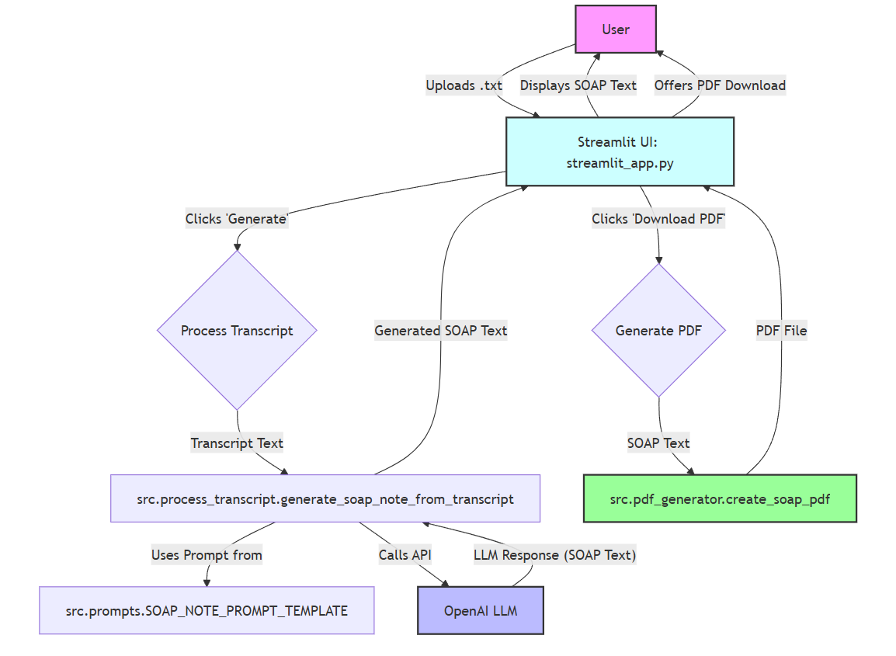

# Cofactor AI - ML Engineer Take-Home: Section 1 - Idealized SOAP Note Generator

## 1. Overview

This project implements a pipeline to transform unstructured medical encounter transcripts into well-structured SOAP (Subjective, Objective, Assessment, Plan) notes. It leverages an OpenAI Large Language Model (LLM) to extract, summarize, and organize clinical information into the standard SOAP format.

The application provides two main interfaces:
1.  An interactive **Streamlit web application** (`streamlit_app.py`) for processing individual transcript files and downloading the resulting SOAP note as a PDF.
2.  A **batch processing script** (`src/main.py`) for handling multiple transcripts from a directory, saving outputs in both `.txt` and `.pdf` formats.

The goal is to produce clinically relevant, clearly formatted SOAP notes, demonstrating effective LLM application, prompt engineering, and reproducible MLOps practices. Key references include the [Wikipedia article on SOAP notes](https://en.wikipedia.org/wiki/SOAP_note) and the example provided in `./example_notes/Medical Visit SOAP Note.pdf`.

## 2. Features

*   **AI-Powered SOAP Note Generation:** Utilizes OpenAI's GPT models (default: `gpt-4o`, configurable) for information extraction and structuring.
*   **Interactive UI (Streamlit):** Allows `.txt` transcript uploads, displays generated SOAP notes, and offers PDF downloads.
*   **Batch Processing:** Processes all `.txt` transcripts in a specified folder, outputting `.txt` and `.pdf` notes.
*   **Structured Output:** Consistently generates notes with "Subjective," "Objective," "Assessment," and "Plan" sections.
*   **Customizable Prompts:** Includes two prompt templates (`src/prompts.py` for detail, `src/reduced_prompts.py` for token optimization) for flexibility.

## 3. System Architecture & Workflow

The system processes raw transcripts to produce structured SOAP notes, orchestrated by either the Streamlit UI or a batch script.

### Architecture Diagram (Streamlit Application Flow)


*(Assumes image is located at `MLE-Takehome/images/section1_architecture.png`)*

**Workflow:**
1.  **User Interaction:** The User uploads a `.txt` transcript via the Streamlit UI.
2.  **Processing Trigger:** Clicking "Generate" initiates SOAP note creation.
3.  **Core Logic:** The transcript text is passed to `src.process_transcript.generate_soap_note_from_transcript`.
4.  **Prompting:** This function constructs a detailed prompt using a template (from `src.prompts.py` or `src.reduced_prompts.py`) and the transcript.
5.  **LLM Call:** An API call is made to the configured OpenAI LLM (e.g., GPT-4o).
6.  **Response & Display:** The LLM returns the SOAP note text, which is displayed in the UI.
7.  **PDF Generation:** If "Download PDF" is clicked, the SOAP text is converted to a PDF by `src.pdf_generator.create_soap_pdf` (or `create_soap_pdf_bytes`), and offered for download.

The batch script (`src/main.py`) employs similar core logic (steps 3-5 & 7 for PDF) for each transcript.

## 4. Project Structure

```plaintext
MLE-Takehome/
├── example_notes/                  # Provided example notes
│   ├── Complex_EMR_Note.pdf
│   ├── Medical_Visit_SOAP_Note.pdf
│   └── Simple_EMR_Note.pdf
├── images/                         # Contains architecture diagrams
│   └── section1_architecture.png
├── output_soap_notes_pdf/          # Output for PDF SOAP notes (batch mode)
├── output_soap_notes_txt/          # Output for TXT SOAP notes (batch mode)
├── src/                            # Source code for backend logic
│   ├── __init__.py
│   ├── main.py                     # Script for batch processing
│   ├── pdf_generator.py            # Converts text SOAP notes to PDF
│   ├── process_transcript.py       # Core LLM interaction logic
│   ├── prompts.py                  # Detailed LLM prompt template
│   └── reduced_prompts.py          # Token-optimized LLM prompt template
├── transcripts/                    # Input medical transcripts (.txt)
├── .env                            # For OpenAI API Key (user-created)
├── .gitignore
├── README.md                       # This file
├── requirements.txt                # Python dependencies
└── streamlit_app.py                # Main Streamlit application file
```

## 5. Setup Instructions

### Prerequisites
*   Python 3.8+
*   Conda or `venv` for environment management.
*   An active OpenAI API account with a payment method and API key.

### Steps

1.  **Clone the Repository:**
    ```bash
    git clone https://github.com/pablolozanoa/MLE-Takehome
    cd MLE-Takehome
    ```

2.  **Create and Activate Python Environment:**
    *   Using Conda:
        ```bash
        conda create --name cofactor_env python=3.10 # Or your preferred Python version
        conda activate cofactor_env
        ```
    *   Using `venv`:
        ```bash
        python -m venv venv
        source venv/bin/activate  # Windows: venv\Scripts\activate
        ```

3.  **Install Dependencies:**
    ```bash
    pip install -r requirements.txt
    ```

4.  **Set Up Environment Variables:**
    *   Create a `.env` file in the project root (`MLE-Takehome/.env`).
    *   Add your OpenAI API key:
        ```env
        OPENAI_API_KEY="your_sk-xxxxxxxxxxxxxxxxxxxx_key_here"
        ```
    *   This file is ignored by Git via `.gitignore`.

## 6. How to Run

### A. Streamlit Web Application (Interactive)

1.  Ensure your environment is activated and you are in the project root.
2.  Launch the app:
    ```bash
    streamlit run streamlit_app.py
    ```
3.  Open the provided URL (e.g., `http://localhost:8501`) in a browser.
4.  Upload a `.txt` transcript, click "Generate SOAP Note ✨", review, and download the PDF.

### B. Batch Processing Script (Console)

1.  Ensure your environment is activated and you are in the project root.
2.  Place `.txt` transcripts into the `transcripts/` folder.
3.  Execute the script:
    ```bash
    python -m src.main
    ```
4.  Outputs will be in `output_soap_notes_txt/` and `output_soap_notes_pdf/`.

## 7. Design Decisions

*   **LLM Choice:** Defaults to OpenAI's `gpt-4o` for its advanced understanding, configurable in `src/process_transcript.py`. Alternatives like `gpt-3.5-turbo` or `gpt-4o-mini` can be used to balance cost and performance.
*   **Prompt Engineering:**
    *   Two templates are provided: a detailed version (`src/prompts.py`, default) employing Chain-of-Thought principles and specific instructions, and a token-optimized version (`src/reduced_prompts.py`).
    *   Prompts guide the LLM to extract only explicitly stated information, handle missing data gracefully, and adhere to a precise plain text output format. Best practices from the [Prompting Guide](https://www.promptingguide.ai/) were considered.
*   **Modularity:** Code is organized into `streamlit_app.py` (UI), `src/process_transcript.py` (LLM logic), `src/prompts.py` (prompts), `src/pdf_generator.py` (PDF conversion), and `src/main.py` (batch processing).
*   **User Interface:** Streamlit chosen for rapid development of an interactive web UI.
*   **Output Formats:** `.txt` for accessibility and `.pdf` for document sharing.
*   **Error Handling:** Basic error handling for file operations, API calls, and PDF generation.

### Justification for LLM Use

The core task of interpreting conversational medical dialogue, identifying clinically relevant information across different categories (Subjective, Objective, Assessment, Plan), and structuring it into a coherent note is a complex Natural Language Understanding (NLU) and Natural Language Generation (NLG) problem. LLMs excel at such tasks due to their extensive training on diverse text data and their ability to follow complex instructions.

**Tasks handled by conventional code (Non-LLM):** File I/O, UI rendering (Streamlit), PDF generation (using dedicated libraries), directory management, and overall application flow control.

## 8. Limitations

*   **OpenAI API Dependency:** Relies on OpenAI's service availability, performance, and pricing.
*   **Output Quality:** Dependent on input transcript clarity and LLM interpretation. Human review is crucial for clinical use.
*   **Context Window:** `gpt-4o` (128k tokens) handles long transcripts well, but extreme lengths could still be an issue.
*   **Cost:** `gpt-4o` usage incurs costs; consider model choice for budget.
*   **Specialized Terminology:** Highly niche or new medical jargon might require prompt adjustments or fine-tuning.

## 9. Future Iterations & Improvements

*   **UI Model Selection:** Allow users to choose LLM model via Streamlit.
*   **In-UI Editing:** Permit editing of generated SOAP notes before PDF download.
*   **Enhanced Error Feedback:** More granular and user-friendly error messages.
*   **Advanced PDF Customization:** Options for PDF templates and styling.
*   **Alternative LLM Backends:** Integration with other LLMs (e.g., local models via Ollama).
*   **Rigorous Evaluation:** Implement metrics if a gold-standard dataset becomes available.